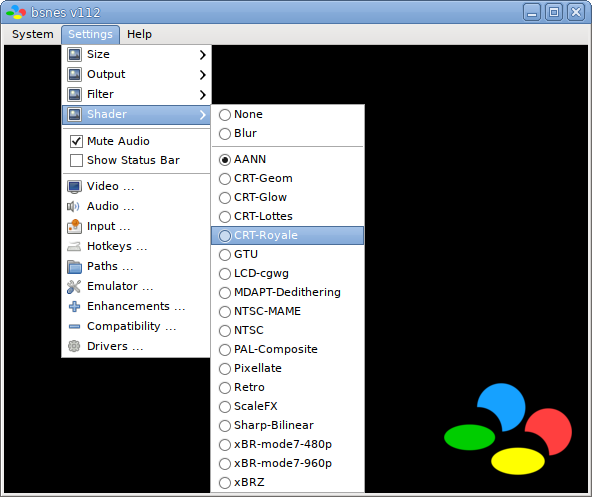
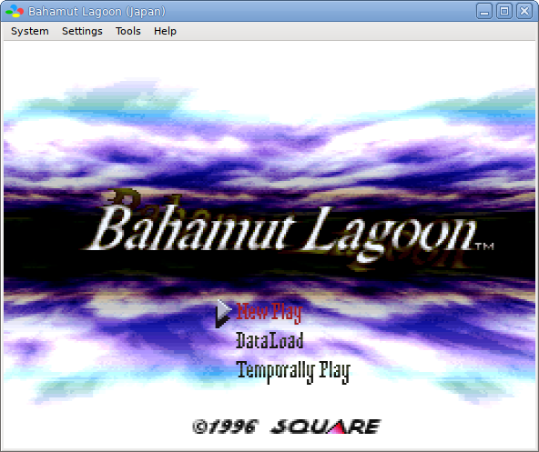
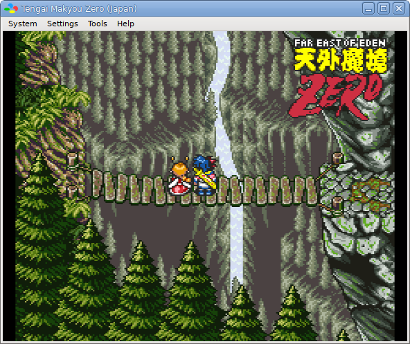

bsnes
=====

bsnes is a multi-platform Super Nintendo (Super Famicom) emulator, originally
developed by [Near](https://near.sh), which focuses on performance,
features, and ease of use.

Unique Features
---------------

  - True Super Game Boy emulation (using the SameBoy core by Lior Halphon)
  - HD mode 7 graphics with optional supersampling (by DerKoun)
  - Low-level emulation of all SNES coprocessors (DSP-n, ST-01n, Cx4)
  - Multi-threaded PPU graphics renderer
  - Speed mode settings which retain smooth audio output (50%, 75%, 100%, 150%, 200%)
  - Built-in games database with thousands of game entries
  - Built-in cheat code database for hundreds of popular games (by mightymo)
  - Built-in save state manager with screenshot previews and naming capabilities
  - Customizable per-byte game mappings to support any cartridges, including prototype games
  - 7-zip decompression support
  - Extensive Satellaview emulation, including BS Memory flash write and wear-leveling emulation
  - Optional higan game folder support (standard game ROM files are also fully supported!)
  - Advanced mapping system allowing multiple bindings to every emulated input

Standard Features
-----------------

  - MSU1 support
  - BPS and IPS soft-patching support
  - Save states with undo and redo support (for reverting accidental saves and loads)
  - OpenGL multi-pass pixel shaders
  - Several built-in software filters, including HQ2x (by MaxSt) and snes_ntsc (by blargg)
  - Adaptive sync and dynamic rate control for perfect audio/video synchronization
  - Just-in-time input polling for minimal input latency
  - Run-ahead support for removing internal game engine input latency
  - Support for Direct3D exclusive mode video
  - Support for WASAPI exclusive mode audio
  - Periodic auto-saving of game saves
  - Auto-saving of states when unloading games, and auto-resuming of states when reloading games
  - Sprite limit disable support
  - Cubic audio interpolation support
  - Optional high-level emulation of most SNES coprocessors
  - Optional emulation of flaws in older emulators for compatibility with older unofficial software
  - CPU, SA1, and SuperFX overclocking support
  - Frame advance support
  - Screenshot support
  - Cheat code search support
  - Movie recording and playback support
  - Rewind support
  - HiDPI support
  - Multi-monitor support
  - Turbo support for controller inputs

Links
-----

  - [Official git repository](https://github.com/bsnes-emu/bsnes)
  - [Official Discord](https://discord.gg/B27hf27ZVf)

Nightly Builds
--------------

  - [Download](https://cirrus-ci.com/github/bsnes-emu/bsnes/master)
  - 
  - 
  - 
  - 

Compiling instructions (for Windows x64):
--------------

If you want to compile by yourself, it's also very easy to. Just follow these steps:

1. You'll need both MinGW and .git installed in your system. If you already have, you can skip these steps:

  I. Download MingGW x64 (http://mingw-w64.org/doku.php). Install and make sure that the following paths are in your enviroment table (you can check searching for "enviroment path" in your windows search and opening "Edit enviroment path").
  
  
  
  II. Download and install git (https://git-scm.com/book/en/v2/Getting-Started-Installing-Git).
  
2. Open a command prompt in your directory of choice and clone bsnes/higan/ares with the command:
`git clone https://github.com/bsnes-emu/bsnes.git`

3. Go to `bsnes` folder with: `cd bsnes`.

4. Now you just need to put the command: `mingw32-make`. The compilation will start.

5. The brand new compiled file will be at directory `./bsnes/out`. Enjoy!

Preview
-------

